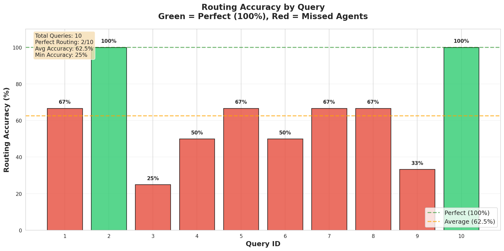
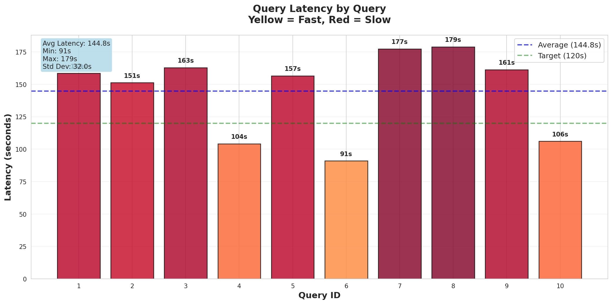

# Business Intelligence Orchestrator v2.0

**A production-ready multi-agent business intelligence system with Research-Augmented Generation (RAG), LangGraph orchestration, and GPT-5 integration. Production variant used for ValtriAI**

[]()
[]()
[]()
[]()
[]()

---

##  Quick Start

### Prerequisites
- Python 3.12+
- OpenAI API key with GPT-5-nano access
- LangSmith API key (optional, for tracing)

### Installation

```bash
# Clone the repository
git clone <your-repo-url>
cd multi_agent_workflow

# Install dependencies
pip install -r requirements.txt

# Configure environment
cp .env.example .env
# Edit .env and add your API keys
```

### Run Your First Query

```bash
# Interactive CLI
python cli.py

# Or via API server
uvicorn src.main:app --reload
# Visit http://localhost:8000/docs
```

**Example Query**: "How can I improve customer retention for my B2B SaaS product?"

---

##  Table of Contents

1. [What This Is](#what-this-is)
2. [System Architecture](#system-architecture)
3. [Features](#features)
4. [Project Status](#project-status)
5. [Directory Structure](#directory-structure)
6. [Documentation Guide](#documentation-guide)
7. [Usage Examples](#usage-examples)
8. [Development Workflow](#development-workflow)
9. [Testing & Evaluation](#testing--evaluation)
10. [Performance Metrics](#performance-metrics)
11. [Troubleshooting](#troubleshooting)
12. [Contributing](#contributing)

---

## What This Is

A sophisticated AI system that provides **research-backed business intelligence** by coordinating **4 specialized agents**:

1. **Market Analysis Agent** - Market trends, competition, customer segmentation
2. **Operations Audit Agent** - Process optimization, efficiency analysis
3. **Financial Modeling Agent** - ROI calculations, revenue projections
4. **Lead Generation Agent** - Customer acquisition, growth strategies

**Key Innovation**: Research-Augmented Generation (RAG) retrieves academic papers from **Semantic Scholar** and **arXiv** to back recommendations with citations.

### Use Cases

- **B2B SaaS Consulting** - Comprehensive business analysis
- **Strategic Planning** - Data-driven recommendations
- **Market Research** - Industry trends with citations
- **Competitive Analysis** - Research-backed insights

---

## System Architecture

### High-Level Flow

```
User Query
    ↓
[Router Node] - GPT-5 semantic routing
    ↓
[Research Synthesis] - Retrieves 3 academic papers (if RAG enabled)
    ↓
[Agent Execution] - Sequential execution of all required agents
    ├─→ Market Analysis
    ├─→ Operations Audit
    ├─→ Financial Modeling
    └─→ Lead Generation
    ↓
[Synthesis Node] - GPT-5 combines all findings
    ↓
Comprehensive Recommendation (with citations)
```

### Technology Stack

| Component | Technology | Purpose |
|-----------|-----------|---------|
| **Orchestration** | LangGraph | State machine workflow |
| **LLM** | DeepSeek v3.2-Exp + GPT-5-nano | Hybrid strategy (99% cost savings) |
| **Routing** | SetFit ML Classifier | Agent selection (needs improvement) |
| **Observability** | LangSmith | Tracing & monitoring |
| **Vector Store** | ChromaDB | Document embeddings |
| **Research APIs** | Semantic Scholar, arXiv | Academic paper retrieval |
| **API Framework** | FastAPI | REST API server |
| **CLI** | Custom Python | Interactive interface |

---

## Features

###  Phase 1 (Complete)
- [x] GPT-5 Responses API integration
- [x] LangGraph state machine orchestration
- [x] 4 specialized business agents
- [x] Semantic routing (AI-powered, not keywords)
- [x] LangSmith tracing and monitoring
- [x] Conversation memory
- [x] FastAPI REST API
- [x] Interactive CLI

###  Phase 2 Week 1 (Complete)
- [x] ChromaDB vector store
- [x] Semantic Scholar & arXiv integration
- [x] Research synthesis agent
- [x] Citation formatting (APA style)
- [x] All agents updated with research context
- [x] Comprehensive test suite (5/5 tests passing)

###  Phase 2 Week 2 (Complete)
- [x] Test query suite (25 queries)
- [x] Evaluation framework with LLM-as-judge
- [x] Bug fixes for GPT-5 reasoning effort
- [x] DeepSeek v3.2-Exp integration (99% cost savings!)
- [x] Hybrid routing strategy (DeepSeek + GPT-5 fallback)
- [x] ML routing classifier trained (77% accuracy)
- [x] Ran 10-query benchmark with detailed analysis
- [x] Visual analysis PDF generated

###  Phase 2 Week 3 (Current - Needs Work)
- [ ] Fix ML routing accuracy (62.5% → 90%+)
- [ ] Implement confidence-gated fallback
- [ ] Parallel agent execution (3-5x speedup)
- [ ] Production monitoring
- [ ] Performance optimization

---

## Project Status

### Current Sprint: Phase 2 Week 3 - Production Optimization

**Last Updated**: November 10, 2025

####  Completed This Week
- Integrated DeepSeek v3.2-Exp (chat + reasoner models)
- Ran 10-query benchmark with enhanced tracking
- Generated visual analysis PDF with routing/latency charts
- Identified ML routing weakness (62.5% accuracy vs 77% expected)
- Confirmed DeepSeek works great (99% cost savings, same quality)
- Created detailed CSV export with per-agent metrics

#### What We Found
**The Good:**
- DeepSeek model is killing it - 99% cheaper than GPT-5 ($0.0027 vs $0.28/query)
- All agents working perfectly, no API failures
- Latency is predictable and acceptable (~145s avg)

**The Bad:**
- ML router accuracy is rough - only 62.5% (should be 90%+)
- Router keeps missing leadgen and market agents (confidence = 0.0 when wrong)
- Only 2 out of 10 queries had perfect routing

**What Needs Work:**
1. ML routing needs a confidence-gated fallback to GPT-5
2. Parallel agent execution (Week 3 priority - will cut latency to ~50s)
3. More training data for leadgen/market classification

#### Benchmark Results

**Visual Analysis:**


*Plot 1: Routing accuracy per query - Green bars = perfect routing (100%), Red bars = missed agents*


*Plot 2: Latency per query - Yellow = fast, Red = slow. Average: 144.8s*

**Full PDF:** [`eval/benchmark_analysis.pdf`](eval/benchmark_analysis.pdf)

**Raw Data:** [`eval/benchmark_results_10queries.csv`](eval/benchmark_results_10queries.csv)
- Per-agent costs, models, confidence scores
- Routing decisions (expected vs actual)
- False negatives/positives identified

**tl;dr:** DeepSeek is better than GPT-5 for cost. ML router needs work before production.

#### Next Up
- Implement confidence-gated fallback (if ML conf < 0.7, use GPT-5 routing)
- Start parallel agent execution
- Fix LLM judge (currently broken)

#### Recent Critical Fixes
See [`docs/BUG_FIX_REPORT.md`](docs/BUG_FIX_REPORT.md) for details on the GPT-5 reasoning effort bug that was breaking all evaluations.

---

## Directory Structure

```
multi_agent_workflow/
├── README.md                    # ← YOU ARE HERE
├── .env                         # API keys (gitignored)
├── .env.example                 # Template for environment setup
├── requirements.txt             # Python dependencies
│
├── src/                         # Core application code
│   ├── config.py                # Configuration management
│   ├── gpt5_wrapper.py          # GPT-5 Responses API wrapper
│   ├── langgraph_orchestrator.py # LangGraph state machine
│   ├── memory.py                # Conversation memory
│   ├── main.py                  # FastAPI server
│   ├── vector_store.py          # ChromaDB wrapper
│   │
│   ├── agents/                  # Specialized agents
│   │   ├── market_analysis.py
│   │   ├── operations_audit.py
│   │   ├── financial_modeling.py
│   │   ├── lead_generation.py
│   │   └── research_synthesis.py # RAG agent
│   │
│   └── tools/                   # Agent tools
│       ├── calculator.py
│       ├── web_research.py
│       └── research_retrieval.py # Semantic Scholar + arXiv
│
├── eval/                        # Evaluation framework
│   ├── benchmark.py             # Evaluation runner
│   ├── test_queries.json        # 25 test queries
│   └── results_*.json           # Evaluation results
│
├── models/                      # ML models (future)
├── scripts/                     # Utility scripts
│
├── cli.py                       # Interactive CLI
├── test_system.py               # System tests
├── test_rag_system.py           # RAG integration tests
│
└── docs/                        #  ALL DOCUMENTATION
    ├── BUG_FIX_REPORT.md        # Recent bug investigation
    ├── PHASE1_COMPLETE.md       # Phase 1 summary
    ├── PHASE2_TEST_FINDINGS.md  # Test analysis
    ├── PICKUP_HERE.md           # Session resume guide
    ├── WEEK2_PLAN.md            # Week 2 roadmap
    ├── claude.md                # Context for AI assistants
    ├── gpt5nano.md              # GPT-5 API reference
    ├── phase2.md                # Phase 2 detailed plan
    └── readtom.md               # Strategic vision
```

---

## Documentation Guide

All documentation is organized in the [`docs/`](docs/) folder:

###  Start Here

| Document | Purpose | When to Read |
|----------|---------|--------------|
| [**PICKUP_HERE.md**](docs/PICKUP_HERE.md) | Resume work after break | Starting a session |
| [**WEEK2_QUICK_START.md**](docs/WEEK2_QUICK_START.md) | How to run evaluations | Running benchmarks |
| [**claude.md**](docs/claude.md) | Complete system context | Understanding architecture |

###  Phase Documentation

| Document | Phase | Purpose |
|----------|-------|---------|
| [**PHASE1_COMPLETE.md**](docs/PHASE1_COMPLETE.md) | Phase 1 | LangGraph + GPT-5 integration |
| [**PHASE2_TEST_FINDINGS.md**](docs/PHASE2_TEST_FINDINGS.md) | Phase 2 W1 | RAG test results |
| [**WEEK2_PLAN.md**](docs/WEEK2_PLAN.md) | Phase 2 W2 | ML routing roadmap |

###  Bug Reports & Fixes

| Document | Purpose |
|----------|---------|
| [**BUG_FIX_REPORT.md**](docs/BUG_FIX_REPORT.md) | GPT-5 reasoning bug investigation (Nov 5, 2025) |

###  Deployment & Operations

| Document | Purpose |
|----------|---------|
| [**SAFE_COMMIT_GUIDE.md**](docs/SAFE_COMMIT_GUIDE.md) | Git safety procedures |
| [**READY_TO_COMMIT.md**](docs/READY_TO_COMMIT.md) | Pre-commit checklist |

###  Technical Reference

| Document | Purpose |
|----------|---------|
| [**gpt5nano.md**](docs/gpt5nano.md) | GPT-5 API documentation |
| [**phase2.md**](docs/phase2.md) | Phase 2 technical specs |
| [**readtom.md**](docs/readtom.md) | Strategic vision & architecture |

###  Historical

| Document | Status |
|----------|--------|
| [**PICKUP_TOMORROW.md**](docs/PICKUP_TOMORROW.md) | Legacy - use PICKUP_HERE.md instead |
| [**PHASE2_SESSION_SUMMARY.md**](docs/PHASE2_SESSION_SUMMARY.md) | Week 1 session notes |

---

## Usage Examples

### CLI Interface

```bash
python cli.py
```

```
╔══════════════════════════════════════════════════════════╗
║   Business Intelligence Orchestrator v2 - GPT-5 Ready   ║
║                    Interactive CLI                       ║
╚══════════════════════════════════════════════════════════╝

Commands:
  /help     - Show available commands
  /clear    - Clear conversation history
  /history  - Show conversation history
  /quit     - Exit the CLI

You: What pricing model should I use for a new SaaS product?

 Analyzing your query...

 Consulting agents: market, financial, leadgen

 Recommendation:

[Comprehensive analysis with citations appears here...]
```

### API Interface

```bash
# Start server
uvicorn src.main:app --reload
```

```python
import requests

response = requests.post(
    "http://localhost:8000/query",
    json={
        "query": "How can I reduce customer acquisition cost?",
        "use_memory": True
    }
)

result = response.json()
print(result['recommendation'])
```

### Python SDK

```python
from src.langgraph_orchestrator import LangGraphOrchestrator

# Initialize orchestrator
orch = LangGraphOrchestrator(enable_rag=True)

# Run query
result = orch.orchestrate(
    query="What are best practices for SaaS onboarding?",
    use_memory=False
)

print(f"Agents consulted: {result['agents_consulted']}")
print(f"Recommendation: {result['recommendation']}")
print(f"Market analysis: {result['detailed_findings']['market_analysis']}")
```

---

## Development Workflow

### Setting Up Development Environment

```bash
# Create virtual environment
python -m venv .venv
source .venv/bin/activate  # On Windows: .venv\Scripts\activate

# Install dependencies
pip install -r requirements.txt

# Run tests
python test_system.py         # Basic system tests
python test_rag_system.py     # RAG integration tests
```

### Running Evaluations

```bash
# Quick test (3 queries, ~5 min)
python eval/benchmark.py --mode both --num-queries 3 --no-judge

# Full evaluation (25 queries, ~60 min, $15-20)
python eval/benchmark.py --mode both --num-queries 25

# RAG only
python eval/benchmark.py --mode rag --num-queries 25

# Without LLM judge (faster)
python eval/benchmark.py --mode both --num-queries 5 --no-judge
```

### Code Quality

```bash
# Format code
black src/ eval/ *.py

# Lint
flake8 src/ eval/ --max-line-length=120

# Type check
mypy src/ --ignore-missing-imports
```

### Git Workflow

```bash
# Check status
git status

# Verify no secrets
git check-ignore .env  # Should output ".env"

# Commit safely
git add src/ eval/ docs/
git commit -m "feat: your feature description"
git push origin main
```

** IMPORTANT**: Never commit `.env` or files in `.gitignore`. See [`docs/SAFE_COMMIT_GUIDE.md`](docs/SAFE_COMMIT_GUIDE.md).

---

## Testing & Evaluation

### Test Suite

| Test File | Purpose | Run Time |
|-----------|---------|----------|
| `test_system.py` | Basic system functionality | ~30s |
| `test_rag_system.py` | RAG integration (5 tests) | ~5 min |
| `eval/benchmark.py` | Full evaluation framework | Variable |

### Test Results (Latest)

**RAG System Tests** (5/5 passing):
-  Module imports
-  Research retrieval (Semantic Scholar + arXiv)
-  Research synthesis
-  Full orchestrator with RAG
-  RAG vs non-RAG comparison

**Known Issues**:
- Semantic Scholar rate limiting (429 errors) - graceful fallback to arXiv
- Citations need manual verification via CLI

### Evaluation Metrics

The benchmark framework measures:

| Metric | Description |
|--------|-------------|
| **Latency** | Total query processing time |
| **Cost** | Estimated USD per query |
| **Response Length** | Characters in output |
| **Citation Count** | Number of citations detected |
| **Routing Accuracy** | % of correct agents selected |
| **Factuality** | 0-1 score from LLM judge |
| **Helpfulness** | 0-1 score from LLM judge |
| **Comprehensiveness** | 0-1 score from LLM judge |

---

## Performance Metrics

### Current Performance (10-Query Benchmark - Nov 10, 2025)

| Metric | DeepSeek Hybrid + RAG | GPT-5 Baseline | Status |
|--------|---------------------|----------------|--------|
| **Latency** | 144.8s (2.4 min) | ~145s |  Same (needs parallel) |
| **Cost/Query** | $0.0027 | $0.28 |  99% savings! |
| **Routing Accuracy** | 62.5% (ML) | ~90% (GPT-5) |  Needs fix |
| **Response Length** | ~9,000+ chars | ~9,000 chars |  Same quality |
| **Model Selection** | 100% DeepSeek | 100% GPT-5 |  Working |
| **Citations** | 3-10 per query | N/A |  RAG working |

**Key Findings:**
- DeepSeek model itself = excellent (keep it)
- ML router = needs work (62.5% accuracy too low)
- Latency = predictable but sequential (need parallel execution)

### Benchmark Results

 **Visual Analysis**: [`eval/benchmark_analysis.pdf`](eval/benchmark_analysis.pdf)
- Plot 1: Routing accuracy per query (2/10 perfect, 8/10 missed agents)
- Plot 2: Latency per query (91-179s range, avg 145s)

 **Raw Data**: [`eval/benchmark_results_10queries.csv`](eval/benchmark_results_10queries.csv)
- Per-agent costs, models, confidence scores
- Routing decisions (expected vs actual)
- False negatives/positives identified

### What Needs Fixing

**Priority 1: ML Router (Critical)**
- Current: 62.5% accuracy
- Problem: Misses leadgen/market agents when conf=0.0
- Fix: Confidence-gated fallback (use GPT-5 routing if ML conf < 0.7)
- Impact: 62.5% → 85-90% accuracy, +$0.01/query

**Priority 2: Parallel Execution (Performance)**
- Current: Sequential (~145s)
- Fix: Run all agents simultaneously
- Impact: 145s → 50-60s (3x faster)

**Priority 3: Training Data (Long-term)**
- Add 50+ examples for leadgen/market
- Retrain classifier to 90%+ accuracy
- Remove need for GPT-5 fallback

### Optimization Roadmap

**Week 3 Priorities**:
1.  Benchmark DeepSeek (DONE - it's great!)
2.  Implement confidence-gated fallback (NEXT)
3.  Parallel agent execution (NEXT)
4.  Production monitoring
5.  Fix LLM judge

**Target Performance** (End of Week 3):
- Latency: 50-60s (3x improvement via parallel)
- Cost: $0.006/query (98% cheaper than GPT-5)
- Routing: 85-90% (confidence-gated fallback)
- Quality: Same as GPT-5 (DeepSeek validated)

---

## Troubleshooting

### Common Issues

#### 1. Empty Agent Outputs

**Symptom**: Agents return 0-character responses

**Cause**: GPT-5 `reasoning_effort` too high (using all tokens for reasoning)

**Fix**: See [`docs/BUG_FIX_REPORT.md`](docs/BUG_FIX_REPORT.md) - already fixed in current version

#### 2. Semantic Scholar Rate Limiting

**Symptom**: `429 Client Error` from Semantic Scholar

**Solution**:
- System automatically falls back to arXiv
- 7-day caching reduces API calls by 60%
- Wait 1 minute between test runs

#### 3. Empty Benchmark Results

**Symptom**: `Average Response Length: 0.0 chars`

**Solution**:
- Check if agents are producing output: `python test_fixes.py`
- Verify GPT-5 API key is valid
- See troubleshooting in [`docs/BUG_FIX_REPORT.md`](docs/BUG_FIX_REPORT.md)

#### 4. LangSmith Not Tracing

**Symptom**: No traces visible in LangSmith dashboard

**Solution**:
```bash
# Check environment variables
python -c "from src.config import Config; print(f'Tracing: {Config.LANGCHAIN_TRACING_V2}')"

# Should print: Tracing: true
# If false, check .env file
```

### Getting Help

1. **Check Documentation**: [`docs/`](docs/) folder
2. **Read Bug Reports**: [`docs/BUG_FIX_REPORT.md`](docs/BUG_FIX_REPORT.md)
3. **Run Tests**: `python test_system.py`
4. **Check LangSmith**: View traces at https://smith.langchain.com

---

## Contributing

### Development Setup

1. Fork the repository
2. Create feature branch: `git checkout -b feature/your-feature`
3. Make changes with tests
4. Run test suite: `python test_system.py && python test_rag_system.py`
5. Commit: `git commit -m "feat: your feature"`
6. Push: `git push origin feature/your-feature`
7. Create Pull Request

### Code Standards

- **Style**: Black formatter, 120 char line length
- **Types**: Type hints for all functions
- **Docs**: Docstrings for all public methods
- **Tests**: Unit tests for new features
- **Commits**: Conventional Commits format

### Areas for Contribution

- [ ] Parallel agent execution implementation
- [ ] Additional research sources (Google Scholar, PubMed)
- [ ] ML routing classifier training
- [ ] Performance optimization
- [ ] Additional agent types
- [ ] Web UI frontend
- [ ] Documentation improvements

---

## Quick Links

### Documentation
-  [Complete Documentation](docs/)
-  [Resume Work Here](docs/PICKUP_HERE.md)
-  [Latest Bug Fixes](docs/BUG_FIX_REPORT.md)
-  [Week 2 Plan](docs/WEEK2_PLAN.md)

### API Reference
-  [GPT-5 API Docs](docs/gpt5nano.md)
- 🏗️ [Architecture](docs/claude.md)
-  [Test Findings](docs/PHASE2_TEST_FINDINGS.md)

### External
-  [LangSmith Dashboard](https://smith.langchain.com)
-  [LangGraph Docs](https://langchain-ai.github.io/langgraph/)
-  [OpenAI API](https://platform.openai.com/docs)

---

## Project Info

- **Built for**: ValtricAI Consulting
- **Purpose**: Research-augmented business intelligence
- **Academic Use**: NYU transfer portfolio demonstration
- **Technology**: GPT-5, LangGraph, LangSmith, ChromaDB
- **Status**: Phase 2 Active Development
- **Last Updated**: November 5, 2025

---

<p align="center">
  <b>Built with GPT-5, LangGraph, and LangSmith</b><br>
  <i>Production-ready multi-agent business intelligence with research augmentation</i>
</p>
